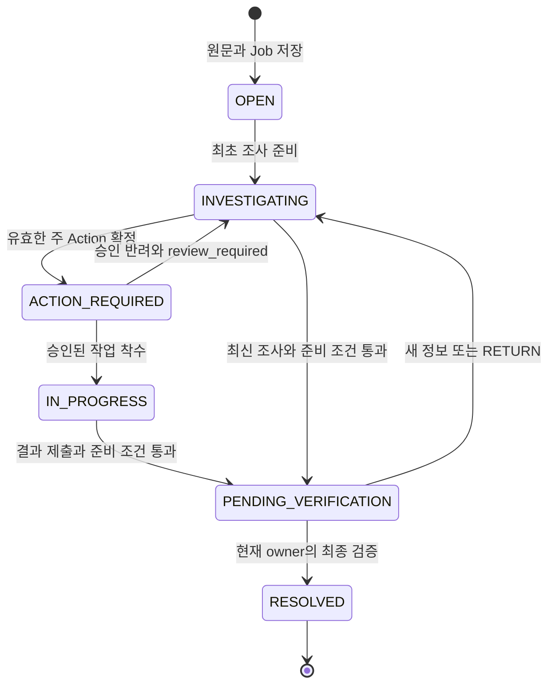

# 03. 도메인·상태·데이터 모델

> v0.3 구현 문서 · 2026-10-09 · **설계 계약 / 런타임 검증 NOT_RUN**
>
> ZIP v0.2의 문서 구성을 따르며, 도메인은 통합안 v0.3과 [결정 기록](11_DECISIONS_AND_SOURCES.md)의 D01–D07을 적용한다. 물리 스키마와 앱은 아직 구현되지 않았다.

## 1. 용어와 기능 책임

| 용어 | 의미 | 기능 책임 |
|---|---|---|
| Incident | 설비 하나의 문제를 제보부터 사람의 해결 확인까지 추적하는 사건 | F0 계약, F1 접수, F2 작업, F3 책임 이전, F4 종료 |
| Message | 사건에 속한 원문·추가 정보·답변·결과. 수정은 새 기록으로 남김 | 생성하는 기능 |
| Request | 목적과 지정 응답자가 있는 영속 확인 질문 | F1 접수·AI 조사·질문과 답변 / 재곤 |
| Action / Approval | 수행할 주 작업과 사람이 승인한 내용 | F2 작업 제안 확정·승인·착수·결과 / 민재 |
| Handover / Item revision | 두 교대 사이 사건별 인계 내용과 인수 확인 | F3 교대 인계·인수 / 재곤 |
| Resolution case | 사람이 해결을 확인한 시점의 불변 사건 snapshot | F4 최종 검증·해결 이력 / 민재 |
| Evidence | 원문과 출처·버전을 보존하는 참조. 현실의 사실 여부를 보증하지 않음 | 생성하는 기능, 공통 검증 F0 |
| Job / AgentRun | 영속 실행 예약과 한 번의 모델·도구 실행 시도 | F1, 공통 큐·잠금 계약 F0 |

담당은 초기 분담안이다. 각 기능 담당자가 해당 화면·API·DB·시험을 끝까지 구현한다. 공유 Incident, enum, migration registry는 F0 통합 담당 재곤이 한 번에 한 변경을 통합하고 민재가 검토한다.

## 2. 저장 상태와 전이

| 대상 | 저장 enum |
|---|---|
| Incident.status | `OPEN / INVESTIGATING / ACTION_REQUIRED / IN_PROGRESS / PENDING_VERIFICATION / RESOLVED` |
| Action.status | `PROPOSED / APPROVED / IN_PROGRESS / COMPLETED / REJECTED` |
| Request.status | `OPEN / ANSWERED` |
| Approval.decision | `APPROVE / REJECT` |
| Verification.decision | `RESOLVE / RETURN` |
| Handover item revision ACK | `PENDING / ACKNOWLEDGED` |
| Job.status | `QUEUED / RUNNING / SUCCEEDED / FAILED / SUPERSEDED` |
| AgentRun.status | `RUNNING / WAITING_INPUT / SUCCEEDED / FAILED / SUPERSEDED` |
| Agent decision | `ASK_USER / PROPOSE_ACTION / WAIT_EXISTING / REQUEST_VERIFICATION / BLOCKED` |

| 명령·사건 | 전이와 필수 조건 |
|---|---|
| 최초 접수 | `OPEN`, version=1. 현재 교대 책임자를 owner로 서버 지정 |
| 최초 worker 조사 준비 | `OPEN → INVESTIGATING`을 커밋한 뒤 input_version 확보 |
| 질문 저장·일반 추가 메시지 | 현재 상태 유지. 단, 검증 대기 중 새 메시지는 `INVESTIGATING`으로 전이 |
| Action 확정 | generation=1의 새 `PROPOSED`, Incident `ACTION_REQUIRED` |
| 승인 | `PROPOSED → APPROVED`, Incident `ACTION_REQUIRED` 유지 |
| 승인 반려 | `PROPOSED → REJECTED`, Incident `INVESTIGATING`, `review_required=true` |
| 착수 | `APPROVED → IN_PROGRESS`, Incident `IN_PROGRESS` |
| 결과 | `IN_PROGRESS → COMPLETED`. 준비 조건 통과 시 `PENDING_VERIFICATION`; 미충족이면 현재 상태와 미충족 항목 유지 |
| 최신 조사 후 검증 준비 | `REQUEST_VERIFICATION`을 서버가 검증해 `PENDING_VERIFICATION`. 모델의 종료 승인 아님 |
| 검증 반려 | `PENDING_VERIFICATION → INVESTIGATING`, 완료 Action 보존, `review_required=true` |
| 해결 | 현재 owner의 `RESOLVE`와 종료 게이트 통과 시 `RESOLVED` |
| ACK | owner만 수신 책임자로 이전. Incident 업무 상태와 Action assignee 유지 |

조사 재실행이 기존 `IN_PROGRESS`를 무조건 바꾸지 않는다. `waiting_for_input`은 필수 OPEN Request의 존재로 계산한다. `review_required`, 인수 여부, 실행 상태는 Incident.status와 별도다.

### 반려 후 Phase 1 경계 — D02

승인 반려 또는 검증 RETURN에는 사유·작성자·시각을 보존한다. Phase 1에는 `review_required` 해제 API가 없고 generation은 항상 1이다. 읽기·추가 메시지·인계는 가능하지만 신규 정식 Action, 자동 검증 준비, RESOLVE는 차단한다. 이 상태의 Job은 필요할 때 analysis만 갱신한다. 화면은 **후속 검토 필요**로 표시하며 완료로 계산하지 않는다. 두 번째 작업과 해제 절차는 Phase 2에서 사람의 명시적 후속 승인 계약을 설계한다.

## 3. 핵심 불변식

| ID | 반드시 지킬 계약 |
|---|---|
| INV-01 | 최초 Message는 Incident와 함께 저장한다. 미연결 Report나 자동 사건 병합은 Phase 1에 없다. |
| INV-02 | 원문·답변·완료·승인·검증·표시된 인계 revision은 덮어쓰지 않는다. |
| INV-03 | Action COMPLETED, ACK, AgentRun 성공만으로 Incident가 해결되지 않는다. |
| INV-04 | Agent는 조회·run 내부 후보만 만든다. 승인·착수·사람 결과·해결·설비 제어 권한은 없다. |
| INV-05 | 업무 변화·이벤트·필요한 Job·명령 응답은 같은 트랜잭션에서 확정한다. |
| INV-06 | actor·site·role·owner·assignee의 권한 근거는 서버 세션과 담당표다. |
| INV-07 | 현재 업무 버전과 현재 lease를 모두 확인한 worker만 업무를 확정한다. |
| INV-08 | 활성 주 Action은 최대 하나이며 generation=1의 완료·반려 작업도 재생성하지 않는다. |
| INV-09 | 검색 ERROR와 EMPTY는 다르다. analysis는 저장된 업무 상태를 대체하지 않는다. |
| INV-10 | 인계 집합은 서버가 교대·사업장 범위로 만든다. AI 실패에도 기본 목록은 보존한다. |
| INV-11 | ACK는 owner를 바꾸고 assignee를 유지한다. 자신의 ACK만으로 즉시 재인수를 요구하지 않는다. |
| INV-12 | 빈 Action 집합, 미승인 결과, 미응답 필수 질문, 반려 미해소 상태는 종료할 수 없다. |

## 4. 논리 데이터 구조

PostgreSQL·SQLAlchemy·Alembic을 사용할 계획이다. ID는 서버 발급 UUID, 화면용 `display_id`는 별도다. 모든 업무 관계에 동일 site와 Incident 관계를 검증한다. 아래는 최소 필드 계약이며 물리 테이블 확정·migration 실행은 NOT_RUN이다.

### 4.1 사용자·교대·설비

| 저장소 | 최소 필드 | 제약 |
|---|---|---|
| users | id, site_id, display_name, role, enabled | role은 worker 또는 supervisor. 데모 계정 4개 |
| shifts | id, site_id, label, starts_at, ends_at, supervisor_id | 날짜를 포함한 **교대 발생 ID**. 템플릿 이름과 구별 |
| shift_assignments | shift_occurrence_id, user_id, duty | 작업자·정비·책임자 배정. 서버의 권한·대상자 판단 근거 |
| equipment | id, site_id, code, aliases, default_maintainer_id | 대표 설비 1대와 비교 1대 |

접수 시 현재 교대 발생을 서버가 해석하고 지정 supervisor를 owner로 정한다. 매핑이 없으면 `422 SHIFT_ASSIGNMENT_MISSING`이며 불완전한 사건을 만들지 않는다.

### 4.2 incidents / messages / requests

| 저장소 | 최소 필드 |
|---|---|
| incidents | id, display_id, site_id, equipment_id, reporter_id, origin_shift_occurrence_id, owner_shift_occurrence_id, owner_id, status, version, action_generation=1, review_required, review_reason, analysis, created_at, updated_at, resolved_at |
| messages | id, site_id, incident_id, author_id, kind, text, reply_to_request_id, action_id, correction_of, observed_at, received_at |
| requests | id, incident_id, target_user_id, purpose_code, question, is_required, status, evidence_refs, response_message_id, version, created_at, answered_at |

Message.kind는 `REPORT / NOTE / REPLY / ACTION_RESULT / CORRECTION`. 원문 text는 append-only다. correction_of가 있으면 같은 Incident의 기존 Message인지 검사한다. `reply_to_request_id`와 `correction_of`는 동시에 지정할 수 없다. 답변과 정정은 별도 입력이며 동시 지정 요청은 저장 전에 거부한다. Request의 목적 코드는 `VERIFY_SCOPE / VERIFY_RESULT` 서버 허용 목록이며 OPEN 중복 키는 `(incident_id, target_user_id, purpose_code)`다. 질문 답변은 같은 Incident의 OPEN Request와 지정 대상자만 허용한다. Request.version은 생성 1, 답변 시 +1이다.

analysis에는 `run_id, base_version, decision, facts, hypotheses, missing_information, source_refs, reason`을 저장한다. `is_stale = base_version != incident.version`은 보수적으로 계산한다. 동일 run이 만든 질문·Action도 버전을 증가시키므로 분석 기준 버전과 실제 반영 후 버전을 함께 진단에 표시한다.

### 4.3 actions / approvals / verification 기록

| 저장소 | 최소 필드 |
|---|---|
| actions | id, incident_id, action_slot, action_generation, trigger_event_id, title, scope, completion_criteria, assignee_id, due_at, is_required, evidence_refs, status, revision, version, proposed_by_run_id, result_message_id, completion_evidence_id, created_at, started_at, completed_at |
| approvals | id, action_id, action_revision, decision, reason, payload_hash, approved_payload_snapshot, actor_id, created_at |
| verifications | id, incident_id, decision, notes, evidence_refs, checked_version, applied_version, actor_id, created_at |

`action_slot=MAIN_FOLLOWUP`, `action_generation=1`, `is_required=true`는 서버가 정한다. F1의 후보를 F2 서비스가 검증·확정한다. Action 고유키는 `(incident_id, action_slot, action_generation)`이며 상태와 관계없이 유일하다. 추가로 `(incident_id, action_slot)`의 `PROPOSED/APPROVED/IN_PROGRESS` 부분 UNIQUE를 둔다.

승인 payload 해시에는 scope·assignee·due_at·completion_criteria·revision·근거 참조를 포함한다. 승인 후 편집·취소·재배정 API는 없다. revision은 승인할 내용 버전이고 version은 상태 변경을 포함한다. 정상 Phase 1에서는 revision=1을 유지하며 Action.version은 각 실제 상태 변화에서 증가한다.

### 4.4 evidence / documents / chunks / logs

Evidence: `id, site_id, incident_id, source_type, source_id, source_version, equipment_id, applicability, document_approval, excerpt, content_hash, source_location, observed_at, captured_at`.

source_type은 `message / log / sop / case / completion_report`. 공유 SOP·과거 사례도 선택한 Incident 문맥의 Evidence를 발급하고 출처와 적용 범위를 보존한다. 과거 사례를 현재 설비의 관찰 사실로 바꾸지 않는다. SOP는 승인 상태·버전·설비 적용 범위를 확인한다. 완료 API는 사람이 낸 결과 원문을 Message와 `completion_report` Evidence로 저장한다. 추가 evidence_refs는 선택이며 같은 Incident에서 참조 가능한 기존 근거만 허용한다.

documents·chunks는 승인 문서의 버전, 위치와 검색용 텍스트를 보존하고 logs는 실제 조회한 합성 점검 기록을 담는다. 검색 캐시를 갱신해도 기존 Evidence excerpt를 수정하지 않는다. 해시는 비교 도구이며 법적 증거성이나 현실의 점검 수행을 보장하지 않는다.

### 4.5 handovers / handover_items

| 저장소 | 최소 필드 | 제약 |
|---|---|---|
| handovers | id, site_id, from_shift_occurrence_id, to_shift_occurrence_id, receiver_id, cutoff_at, created_by, created_at | `(site_id, from_shift_occurrence_id, to_shift_occurrence_id)` UNIQUE |
| handover_items | id, handover_id, incident_id, latest_revision | `(handover_id, incident_id)` UNIQUE |
| handover_item_revisions | item_id, revision, snapshot_version, snapshot_json, snapshot_token, created_at | `(item_id, revision)` UNIQUE. 공개 후 불변 |
| handover_acks | id, item_id, revision, actor_id, previous_owner_id, new_owner_id, ack_applied_version, acknowledged_at | `(item_id, revision)` UNIQUE |

snapshot_json은 사건 상태·원문·확정 사실·미응답 질문·작업·owner·assignee·Evidence를 포함한다. token은 item ID·revision·snapshot_version·표시 내용의 정규화 해시에 묶인 서버 발급 비교값이다. 인증 토큰이 아니다. ACK 존재와 최신성은 revision별로 계산한다.

### 4.6 jobs / agent_runs / drafts

| 저장소 | 최소 필드 |
|---|---|
| jobs | id, incident_id, trigger_event_id, job_kind, dedupe_key, status, attempt, lease_token, lease_expires_at, available_at, last_error, created_at, updated_at |
| agent_runs | id, job_id, attempt, trigger_event_id, input_version, applied_version, status, mode, model_id, prompt_version, tool_schema_version, started_at, finished_at, decision_json, steps_json, usage_json, error_json, metadata_json |
| action_drafts | id, run_id, incident_id, input_version, payload_json, created_at |

`job_kind=INVESTIGATE`를 Phase 1 기본값으로 둔다. `(incident_id, trigger_event_id, job_kind)`로 중복을 막는다. 같은 Job 재시도마다 attempt와 AgentRun을 새로 만든다. 이전 run은 종료 후 불변이다. draft는 현재 run과 input_version 안에서만 유효하며 정식 Action이 아니다.

metadata에는 앱 SHA·dirty 상태·비밀 제외 설정 식별자·자료 버전·run_group_id를 담는다. steps에는 실제 tool 이름·정제한 인자·결과 ID·ERROR/EMPTY 구분·소요시간을 담는다. usage는 API가 반환한 관측값만 기록하고 없는 값은 null로 남긴다. 환경 전체·키·모델 내부 추론은 저장하지 않는다.

### 4.7 events / command_receipts / resolution_cases

| 저장소 | 최소 필드 | 역할 |
|---|---|---|
| events | id, site_id, incident_id, type, actor_id, related_ids, payload, occurred_at | 업무 이력과 보존된 거부 입력. append-only |
| command_receipts | site_id, actor_id, idempotency_key, payload_hash, status, http_status, response_json, created_at | 명령 결과 재사용. `(site_id, actor_id, idempotency_key)` UNIQUE |
| resolution_cases | id, incident_id, resolved_version, verification_id, snapshot_json, evidence_refs, created_at | `(incident_id, resolved_version)` UNIQUE. 해결 당시 내용 불변 |

해결 이후 늦은 메시지·결과·ACK는 `rejected_input` 이벤트로 인가된 입력을 보존하고 409를 반환한다. 해결 snapshot과 Incident.version은 변경하지 않는다. 이 이벤트는 새 업무 사실로 수용한 Message와 구별한다. 동일 명령의 거부 응답도 receipt로 재사용해 거부 입력을 중복 저장하지 않는다.

## 5. 버전·트랜잭션 — D01·D05

1. 인증·사업장 범위를 확인하고 같은 완료 receipt가 있으면 원래 HTTP 상태와 응답을 먼저 반환한다.
2. 신규 명령의 멱등 키를 예약한다. 같은 키의 다른 method·route·body 해시는 409다.
3. `Incident → Action/Request → Handover item → Job` 순서로 필요한 행을 잠근다. 복수 행은 각 종류 안에서 ID 정렬한다.
4. 세션 권한, expected version, 상태·근거·승인·반려 게이트를 잠금 안에서 재검증한다.
5. 업무 변화, 이벤트, 관련 인계 revision, 필요한 Job, receipt를 함께 커밋한다. 외부 API는 잠금 밖에서 호출한다.

Incident.version은 **한 업무 트랜잭션당 한 번** 증가한다. 새 일반 메시지·답변·질문 확정·Action 확정/승인/반려/착수/완료·검증·ACK·최초 조사 상태 전이가 대상이다. 같은 enum을 유지하는 추가 메시지나 승인도 증가한다. 한 명령이 결과 Message·Evidence·Action·상태를 함께 바꿔도 +1이다. receipt 재사용, 조회, run·draft·캐시·analysis만 저장하는 작업은 증가하지 않는다.

Action 명령은 `expected_version=Action.version`과 `expected_incident_version=Incident.version`을 모두 받는다. 메시지·검증·ACK의 expected_version은 Incident 버전이다. 질문 답변은 부모 Incident 잠금·버전과 OPEN 상태로 경쟁 답변을 차단한다.

## 6. Worker 소유권과 최종 반영 — D03

- 짧은 claim 트랜잭션에서 `FOR UPDATE SKIP LOCKED`로 QUEUED 또는 만료된 RUNNING Job을 선택한다. attempt를 증가시키고 임의 lease_token·만료 시각·새 run을 만든다.
- Incident의 최초 `OPEN → INVESTIGATING` 처리는 별도 짧은 업무 트랜잭션으로 끝내고 그 뒤 input_version을 잡는다. 기존 업무 진행 상태를 조사 시작만으로 바꾸지 않는다.
- DB 잠금 밖에서 문맥 조회, 검색, OpenAI 도구 루프를 실행한다. 기본 run 60초, lease 90초, 최대 3시도이며 실제 설정은 [환경 문서](ENVIRONMENT.md)를 따른다.
- 최종 업무 반영과 **모든 Job 종료 갱신**은 현재 attempt·lease_token·RUNNING·미만료 조건을 확인해야 한다. 오래된 worker는 최신 성공·실패·analysis를 덮어쓸 수 없다.
- 예외는 시스템 복구 처리의 만료 정리뿐이다. 마지막 허용 attempt의 worker가 사라졌다면 Job 행 잠금 안에서 `RUNNING`, lease 만료, `attempt >= JOB_MAX_ATTEMPTS`를 다시 확인하고 Job과 해당 미종료 run을 `FAILED / ATTEMPTS_EXHAUSTED`로 종료한다. 이전 lease token은 폐기하며 새 attempt·모델 호출·업무 반영은 만들지 않는다. 이는 만료 worker에게 종료 권한을 주는 예외가 아니다.
- 현재 lease 소유자라도 input_version이 달라지면 업무 후보를 적용하지 않고 SUPERSEDED로 끝낸다. 최신 처리 Job이 없고 조사할 일이 남았을 때만 후속 Job을 중복 없이 등록한다. review_required·RESOLVED에서는 자동 반복하지 않는다.
- ASK_USER 확정은 Run WAITING_INPUT, Job SUCCEEDED로 끝난다. 답변이 새 Job을 만든다. 유효 BLOCKED는 SUCCEEDED, 유효 최종 결과 없는 모델·실행기 실패는 FAILED다.
- DB 업무 효과는 한 번만 확정하되 API 호출과 과금은 재시도에서 중복될 수 있다. exactly-once 모델 호출을 주장하지 않는다.

## 7. 교대 snapshot과 인수 — D04

생성자는 출발 교대의 지정 supervisor여야 한다. 서버는 동일 사업장, 시간상 인접한 허용 데모 교대 쌍, 수신 교대 책임자를 검사한다. 클라이언트가 수신자를 지정하지 않는다.

대상은 cutoff 시점 출발 교대 소유·범위의 모든 미해결 사건이다. 재생성할 때는 **같은 Handover에서 이미 인수된 미해결 사건**도 유지해 후속 내용 변경을 재확인할 수 있다. 다른 교대·사업장 사건은 추가하지 않는다. 질문·승인·작업·검증 대기를 모두 포함한다. 해결된 과거 항목은 이전 snapshot에서 읽을 수 있지만 현재 ACK 대상에서 제외한다.

내용이 같으면 기존 revision을 반환하고 바뀌면 새 불변 revision을 만든다. cutoff 후 들어온 대상 사건은 현재 목록에 ‘추가됨’으로 표시하고 다음 snapshot에 포함한다. 미인수 항목의 내용이 바뀌면 즉시 새 revision으로 최신성을 표시한다.

ACK는 지정 수신 supervisor·최신 revision/token·현재 Incident 버전을 모두 검사한다. snapshot v7을 확인하면 owner와 owner_shift를 수신 교대로 바꾸고 Incident v8, `ack_applied_version=8`을 함께 저장한다. **이 ACK 자체는 새 revision을 만들지 않는다.** 이후 메시지로 v9가 되면 새 revision과 재확인이 필요하다. 재ACK는 현재 수신 owner를 다시 확인하며 이전 owner로 돌리지 않는다. assignee는 언제나 유지한다.

## 8. 검증 준비와 최종 해결 — D06

검증 준비 서비스 `evaluate_resolution_readiness(incident)`는 다음을 모두 검사한다.

- review_required=false.
- generation=1의 필수 주 Action이 실제 존재하며 COMPLETED다. 빈 집합은 실패다.
- Action 내용과 일치하는 APPROVE 기록·payload_hash가 있다.
- 필수 Request가 모두 ANSWERED다.
- 같은 사건의 작성자·시각이 있는 결과 Message와 completion_report Evidence가 있다.
- 사용한 Evidence가 같은 사업장·사건의 허용 근거이며 출처 snapshot이 유효하다.

정상 완료 명령은 이 서비스를 직접 호출해 PENDING_VERIFICATION으로 옮길 수 있다. 새 AI 호출은 필수가 아니다. 검증 대기 이후 새 정보가 저장되면 INVESTIGATING으로 바꾸고 새 조사 없이 바로 해결하지 않는다.

최종 RESOLVE는 위 조건에 더해 현재 owner인 supervisor, 현재 expected_version, PENDING_VERIFICATION, 비어 있지 않은 사람 notes를 요구한다. Incident·verification·resolution_case·이벤트를 같은 트랜잭션으로 확정한다. Phase 1의 RESOLVED는 종료 상태이며 재개 API는 없다.

## 9. 시간·보존·검증 연결

저장은 timezone-aware UTC, 화면·교대 해석은 Asia/Seoul이다. 모르는 observed_at은 null이다. 데모 자료는 합성 데이터이며 실제 설비 제어·현장 안전 검증을 증명하지 않는다.

이 계약의 실제 검증은 [시험 계획](07_TEST_PLAN.md)의 T1–T12에서 수행한다. 특히 T9 일반 메시지 버전, T10 반려 후 차단, T11 만료 worker, T12 인계 범위·유일키를 확인한다. 현재 모든 런타임 검증은 NOT_RUN이다.

## F1 기반 세션 구현 보완 — 2026-10-09

공유 물리 모델은 `app.core.models.Base`와 F1의 `0001_f1_foundation`을 기준으로 통합한다. 후속 `0002_session_shift`는 SessionToken에 교대 FK를 추가한다. 기존 token의 교대는 추측하지 않고 NULL을 유지해 재로그인을 요구한다. 세션은 선택한 배정에 고정되며 매 요청 사용자 활성·동일 site·배정 존재를 재검사한다. 업무 상태·버전·권한 계약 D01~D07은 유지한다. 기존 독립 F0 #8 schema는 이 chain에 섞지 않는다. [실행·인계](17_F0_FOUNDATION.md) 참고.
