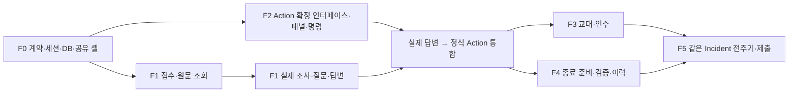

# 08. 기능별 개발·통합 계획

> v0.3 구현 문서 · 2026-10-09. 모든 구현 단계 `NOT_STARTED`, 런타임 검증 `NOT_RUN`.
> 재곤/민재 이름은 초기 배분 제안이며 당사자의 수락이나 구현 완료를 뜻하지 않는다. 일정은 조정 가능한 내부 목표다.

## 1. 개발 원칙

기능 담당자는 해당 기능의 **화면·API·데이터·권한·테스트**를 끝까지 맡는다. 먼저 화면에서 제보한 원문을 실제 DB에서 다시 읽고, 실제 질문과 사람 답변을 연결한다. 이어 같은 Incident에서 승인·착수·인수·결과·사람 검증을 완주한다.

공통 계약·사건 상세 셸·마이그레이션 등록만 한 사람씩 통합한다. 공통 기반 담당이 모든 서버 작업을 맡거나 다른 사람이 모든 화면을 맡는 배분으로 되돌리지 않는다. Agent·검색은 F1 기능에 속하며 Action 확정 이후 명령은 F2, 해결 조건은 F4에 속한다.

## 2. 기능별 작업 묶음

| 기능 / 담당 제안 | 화면 | API·서비스 | 데이터·권한 | 완료 증거 |
|---|---|---|---|---|
| F0 / 재곤 통합·민재 검토 | 세 화면 셸·세션·공통 client | 세션/조회 기반·오류·영수증·잠금 | seed·공통 schema·Job lease 기반 | 실제 부팅·계정별 요청·계약 검사 |
| F1 / 재곤 | 제보·원문·질문·AI 근거 | 접수/메시지·Responses·도구·최종 반영 | Message·Request·AgentRun·Draft·근거, 답변 대상 검사 | 원문 재조회·L1a/L1b·stale/lease 시험 |
| F2 / 민재 | 작업 제안·승인·착수·결과 패널 | Action 확정 서비스·승인/착수/완료 | Action·Approval·completion report, owner/assignee 검사 | 실제 Action ID·승인 전 차단·결과·중복 시험 |
| F3 / 재곤 | 교대 생성·인수·변경 표시 | snapshot 생성·조회·항목 ACK | Handover·불변 revision·ACK, 교대 범위/수신자 검사 | owner만 이전·stale/reACK·대상 집합 시험 |
| F4 / 민재 | 검증 준비·RETURN·해결 이력 | 종료 준비 검사·verification·case 조회 | Verification·ResolvedCase, owner/근거/필수 업무 검사 | 불완전 종료 차단·반려 차단·해결 snapshot |
| F5 / 공동 | 역할별 E2E·리허설 | 통합·실패 복구 검증 | 각 기능 증거와 제출 버전 | T1~T12·L1a/b/L2/L3·제출 접수 확인 |

AC는 [기능명세](02_FUNCTIONAL_SPEC.md), 정확한 필드·응답은 [API](04_API_CONTRACT.md), 상태·트랜잭션은 [도메인](03_DOMAIN_MODEL.md)이 기준이다. 문서가 작성됐다는 이유로 위 증거 열을 완료 처리하지 않는다.

## 3. 의존관계와 병렬화

F2는 F1 live loop 개발과 병렬로 합의된 입력을 사용해 Action 서비스·화면·명령의 계약 시험을 진행한다. 이 시험은 live AI 통합 성공이 아니다. F1 finalizer가 실제 draft를 넘긴 이후에 L1b 증거를 만든다.

F3와 F4는 공유 계약 확정 후 각자 구현할 수 있다. 최종 통합에서는 먼저 미완료 상태로 ACK하고, 그 다음 결과·검증을 수행해 책임 이전이 검증 권한에 반영되는지 확인한다.

## 4. 편집 경계와 공유 파일 통합

다음 경로는 신규 구현을 위한 예정 구조다. 구현 시작 전 실제 저장소와 대조한다.

| 기능 | 독립 편집 영역 제안 | 공유 경계를 넘을 때 |
|---|---|---|
| F1 | `apps/web/src/features/intake/`, `apps/api/app/features/intake/`, `apps/api/app/agent/`, 기능 테스트 | 상세 DTO 확장·새 이벤트/enum·공통 worker 변경은 F0 통합 |
| F2 | `apps/web/src/features/actions/`, `apps/api/app/features/actions/`, 기능 테스트 | Action DTO·확정 서비스·결과 근거 계약을 F1/F4와 먼저 합의 |
| F3 | `apps/web/src/features/handovers/`, `apps/api/app/features/handovers/`, 기능 테스트 | Incident owner 변경·revision 이벤트를 F0/F4와 확인 |
| F4 | `apps/web/src/features/resolution/`, `apps/api/app/features/resolution/`, 기능 테스트 | 준비 조건 서비스를 F1/F2와 공유, 새로운 상태 금지 |
| F0 | `apps/api/app/core/`, `apps/api/migrations/`, web 공통 client/types/routes/상세 셸, Compose | 한 번에 한 통합자, 다른 담당자는 제안·검토 후 자신의 패널만 변경 |

마이그레이션은 기능 담당자가 필요한 테이블·제약을 작성하되 revision 번호와 head는 F0가 순서대로 등록한다. 같은 head에서 각자 만든 migration을 임의 병합하지 않는다. OpenAPI·생성 타입·공유 enum은 한 명이 변경하고 다른 사람이 영향받는 기능을 검토한다.

공유 `IncidentDetailPage`는 한 조회 응답과 `refresh` 흐름을 제공하고 기능 패널을 조합한다. feature 패널은 성공 시 상위 조회 갱신을 요청하며 직접 다른 패널의 상태를 조작하지 않는다. 실제 API가 없는 필드를 UI 임시 값으로 채워 성공을 표시하지 않는다.

## 5. 기능 간 인계 계약

아래 표는 책임·불변 조건을 고정한다. 최종 Python/TypeScript 이름과 JSON 필드는 [API](04_API_CONTRACT.md)에 한 번 정의한다. 이 표의 이름 때문에 별도 HTTP endpoint를 추가하지 않는다.

F2의 내부 인터페이스는 `finalize_action_proposal(tx, *, incident_id, run_id, input_version, draft_id, trigger_event_id) -> {action_id, created, action_version}`이다. F1 finalizer가 F0 공통 트랜잭션·버전·lease 검사를 사용해 호출한다. F2는 같은 트랜잭션에서 필요한 이벤트 정보를 제공하고 직접 commit하지 않는다.

| 제공 → 사용 | 인계할 내용 | 필수 보장 |
|---|---|---|
| F0 → 전체 | 세션 principal, enum, 오류 DTO, CommandReceipt, 거래/잠금 helper | 서버 actor/site, 같은 완료 요청 우선 재사용, 잠금 순서 |
| F1 → F2 | 검증된 선택 draft와 `incident_id`, `run_id`, `input_version`, `trigger_event_id` 참조 | 이번 run·사건·버전의 후보, 허용 근거·배정표, 모델 값을 권한으로 쓰지 않음 |
| F2 → F1 | 정식 Action 확정 서비스와 반환 Action/created 여부 | caller의 transaction 참여, 자체 commit/외부 호출 없음, generation 1·고유키·활성 하나 검사 |
| F2 → F4 | 승인 기록·COMPLETED Action·completion report ID | 작성자·시각·사건 연결, 승인 payload 불변, 결과=직접 해결 아님 |
| F4 → F1/F2 | 공통 종료 준비 검사 결과와 부족 조건 | 반려 차단·필수 Action 존재·답변·승인·결과/근거 확인, 트랜잭션 내 재검증 |
| F3 → 상세/F4 | owner·인계 revision·snapshot/ACK 적용 버전·수신자 | assignee 유지, 자신의 ACK로 즉시 stale 아님, 현재 owner 권한 사용 |
| 각 기능 → F5 | 실제 실행 명령·ID·모드·commit·결과·근거 경로 | NOT_RUN/FAIL을 PASS로 치환하지 않음, mock과 live 분리 |

F1 finalizer는 공통 잠금 순서로 Incident와 관련 업무 행을 검사하고 Job 행을 마지막에 확인한다. F2 서비스가 Action만 먼저 commit하면 최신성 검사와 원자성이 깨지므로 금지한다. F2 완료 처리와 F4 준비 판정도 하나의 업무 트랜잭션에서 적용한다. 외부 OpenAI 호출은 DB 잠금 밖에서 한다.

## 6. 단계별 구현·통합 게이트

| 단계 | 재곤 작업 | 민재 작업 | 다음 단계 진입 증거 |
|---|---|---|---|
| G0 기반 | F0 세션/seed/DB/계약 통합 | F0 계약·화면 슬롯·F2/F4 인터페이스 검토 | 실제 부팅, 네 계정, API 오류 계약, 환경값 검증 |
| G1 첫 저장 | F1 제보 화면/API/DB/Job/조회 | F2 확정 서비스·작업 패널/API·계약 시험 | 화면 입력이 DB에 있고 새로고침 후 동일 원문 |
| G2 조사 통합 | F1 실제 도구·질문·답변·finalizer | F2 실제 draft 확정 연결·승인/착수/결과 | L1a/L1b, 한 Action의 실제 승인·착수 |
| G3 책임·해결 | F3 생성/범위/revision/ACK/화면 | F4 준비 검사/검증/RETURN/case/화면 | 미완료 인수 뒤 결과·수신 owner 검증으로 RESOLVED |
| G4 검증 | F1/F3 결함·L2/L3·버전/lease/인계 | F2/F4 결함·권한/중복/반려/종료 경합 | T1~T12 필수 하위항목·최소 live·재시작 |
| G5 제출 | 자신의 기능 증거·최종 버전 대조 | 자신의 기능 증거·최종 버전 대조 | 앱·PDF·Codex 기록·저장소·접근·접수 확인 |

G0의 모델/key smoke는 계정에서 실제 모델·한국어·도구/출력 지원·기본 지연을 확인하는 단계다. 설정 파일 생성이나 모델 ID 기입은 성공 근거가 아니다. 실행 방법은 앱 생성 후 확정하고 실제 명령을 기록한다.

## 7. 당일 시간 배분 제안

v0.3의 10:50 착수 가정과 17:00 KST 공식 마감을 유지하되 이미 지난 구간은 실제 진척으로 대체한다. 계획 시각을 실행 시각처럼 기록하지 않는다. 행사와 참가 규정의 근거는 [11](11_DECISIONS_AND_SOURCES.md), 제출 절차는 [15](15_SUBMISSION_RUNBOOK.md)에서 확인한다.

| KST 목표 | 작업 | 늦어질 때 판단 |
|---|---|---|
| 10:50~11:10 | G0 공통 계약·부팅·실제 모델 smoke | 설정/권한/기반 연결부터 해결 |
| 11:10~12:30 | G1~G2 접수·질문·답변·Action 통합 | 연결 안 되면 Phase 2/3 제거 |
| 12:30~13:45 | G3 승인·착수·인수·결과·검증 | 화면 수/자료 수를 줄이고 전주기 유지 |
| 13:45~14:45 | G4 필수 검증·결함 수정 | 미통과 핵심을 우선, 확장 시작 금지 |
| 14:45~15:15 | 통과 시에만 대조 검증 등 Phase 2 | 15:00 이후 새 확장 착수 금지 |
| 15:15~16:15 | 기능 동결·같은 버전 배포/영상/PDF/기록 | 새 기능 대신 제출 가능한 범위 명시 |
| 16:15~16:40 | 교차 접근 확인·4분 리허설·제출 | 실제 접수 확인까지 수행 |
| 16:40~17:00 | 제출 여유 | 접근·업로드 문제 대응 |

점심·설명·네트워크 대응은 이 시간 안에 포함한다. 일정이 늦어져도 실행하지 않은 필수 검증을 완료 처리하지 않는다.

## 8. 기능별 착수 체크리스트

- [ ] **F0:** 실재 코드/환경 확인, 세션·seed·DTO·enum 고정, 공통 lock/receipt/lease 계약, 세 화면 셸과 부팅 검증.
- [ ] **F1:** 제보 원자 저장, 추가 메시지 버전 증가, 실제 도구/검색, 질문/답변, stale/lease finalizer, 화면 원문·근거·오류, L1a/L1b/L2/L3.
- [ ] **F2:** F1 호출 인터페이스, 정식 Action 고유키, 승인 payload 불변, owner 승인, assignee 착수/결과, completion report, 작업 패널, 반려 차단 시험.
- [ ] **F3:** 교대 쌍 범위/고유키, 서버 대상 집합, 불변 revision, token/버전/수신자 ACK, owner 이전·assignee 유지, 재ACK·추가 사건·화면.
- [ ] **F4:** 공통 준비 조건, 현재 owner 검증, RETURN 차단, 해결 snapshot, 늦은 쓰기 보존/거부, 검증·이력 패널, 경합 시험.
- [ ] **F5:** 하나의 Incident E2E, 필수 시험 결과·결함 수정 근거, 버전 일치, 실제 접근·접수 증거.

초기 상태에서 체크박스를 채우지 않는다. 담당자는 구현·시험 후 [PROGRESS](../PROGRESS.md)와 [TEST_RESULTS 양식](../templates/TEST_RESULTS.md)에 근거를 연결한다.

## 9. 완료 인계 형식과 첫 실패 진단

기능 인계에는 `F 번호 / AC / 변경 파일 / 실제 seed·생성 ID / DTO 변경 / 실제 실행 명령 / 모드·commit / 결과·근거 / 알려진 실패 / 다음 기능이 호출할 서비스`를 남긴다. 실제 코드·시험 결과 없이 ‘API 준비 완료’라고 넘기지 않는다.

첫 연결 실패는 **원문 저장 → 이벤트/Job → worker claim → 실제 모델 응답 → 도구 결과 전달 → 후보 검증 → 최종 transaction → 조회 응답 → 화면** 순서로 좁힌다. 레이어별 담당자에게 떠넘기기보다 실패한 기능 담당자가 경로를 따라 확인하고 공통 결함만 F0 통합자와 함께 처리한다.

## 10. 축소·확장과 제출 경계

음성, 관리형 검색, 자동 알림, 추가 AI 인계 문장, 별도 대시보드, 복수 작업을 먼저 미룬다. 실제 질문·답변·한 Action·승인·인수 책임 이전·사람 결과·최종 검증과 권한/중복/버전은 유지한다.

Phase 1 통과 뒤에는 충분한 입력에서 질문을 생략하는 대조 L4를 새 기능보다 먼저 권장한다. 반려 후 다음 Action은 차단 해제 권한·generation·이력·재검증 계약을 설계한 다음 별도 작업으로 다룬다. Phase 1에 숨은 재개 버튼을 추가하지 않는다.

제출은 F5 공동 책임이다. 각자 자신의 기능 증거를 정리하고 서로 앱·PDF·영상·SHA·Codex 기록의 범위를 대조한다. 발표 자료 작성만 한 사람에게 고정하거나 다른 사람의 실행 결과를 추정해 채우지 않는다. 실제 제출 전까지 [SUBMISSION](../SUBMISSION.md)은 접수 미확인 상태로 유지한다.
