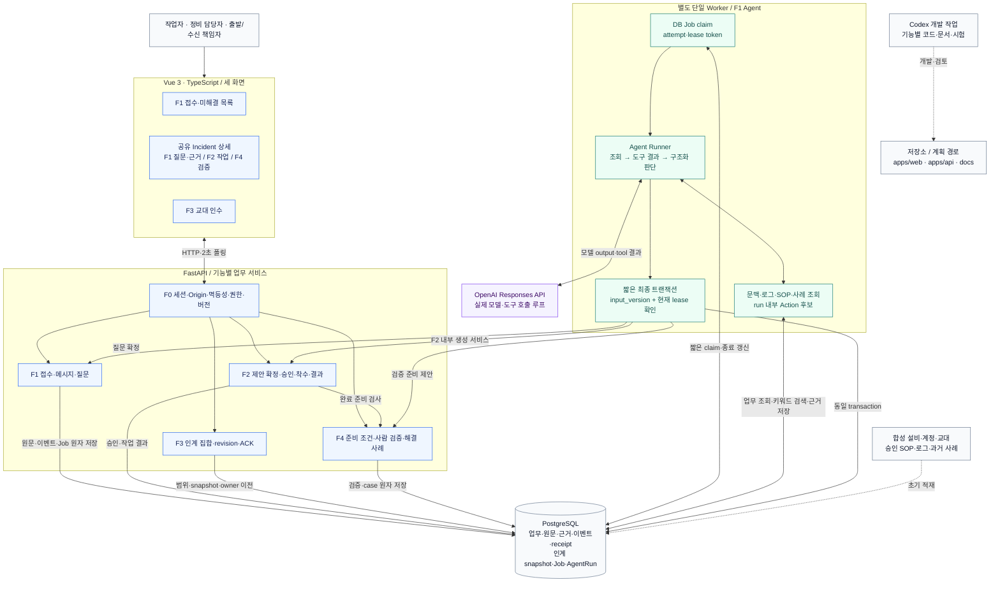

# ShiftLink — 시스템 아키텍처

> v0.3 구현 문서 · 2026-10-09 · **계획된 구조 / 구현·런타임 검증 NOT_RUN**
>
> 같은 사건에서 제보·실제 AI 조사·질문과 답변·승인된 작업·미해결 인수·사람의 최종 해결 확인을 연결한다. v0.2의 문서 형태를 사용하되 기술·상태·범위는 v0.3과 D01–D07로 교체했다.

## 1. 기능별 소유와 공통 기반

| 작업 묶음 | 초기 담당안 | 끝까지 맡는 범위 |
|---|---|---|
| F0 공통 기반·계약 통합 | 재곤, 검토 민재 | 앱 부팅·세션·DB·공유 enum·DTO·잠금·멱등성·migration 통합 |
| F1 접수·AI 조사·질문과 답변 | 재곤 | 접수/질문 화면·API·DB·Agent·검색·관련 시험 |
| F2 작업 제안 확정·승인·착수·결과 | 민재 | 작업 패널·명령 API·Action/Approval 저장·확정 서비스·관련 시험 |
| F3 교대 인계·인수 | 재곤 | 인계 화면·범위 계산·snapshot·ACK·책임 이전·관련 시험 |
| F4 최종 검증·해결 이력 | 민재 | 검증 패널·종료 준비·검증 API·case·관련 시험 |
| F5 전주기 검증·제출 | 공동 | 동일 Incident 완주·실패 재검증·동일 버전 증거와 제출 |

각 담당자는 자기 기능의 화면부터 저장·검증까지 맡는다. 표는 수락·구현 완료 증거가 아니다. Agent 후보 생성은 F1, 후보의 정식 Action 확정과 관련 불변식은 F2다. 공유 상세 화면 shell·DTO·enum·migration registry는 F0가 변경 순서를 관리하며 기능별 패널을 나누어 구현한다.

## 2. 전체 구성과 데이터 흐름

아래 그림의 실선은 계획한 런타임 흐름, 점선은 개발·초기 데이터 관계다. 편집 원본은 [ARCHITECTURE.mmd](ARCHITECTURE.mmd)다.



## 3. 프로세스와 계획 디렉터리

| 구성 | 선택 | 책임 |
|---|---|---|
| Web | Vue 3·TypeScript | 제보/목록, 통합 상세, 교대 인수. 2초 폴링 |
| API | FastAPI·Pydantic | 세션·Origin·권한·버전·명령·조회 |
| DB | PostgreSQL·SQLAlchemy·Alembic | 업무 상태·원문·근거·이력·receipt·Job |
| Worker | 같은 Python 코드의 별도 단일 프로세스 | 영속 Job claim, 모델/도구 루프, 검증한 최종 반영 |
| AI | OpenAI Responses API | 자료 조회 선택·질문·작업 후보·구조화 판단 |
| Search | 실제 키워드 검색 | 승인 SOP·사례·로그의 출처와 내용에 기반한 결과 |
| Local run | F1 기반 Docker Compose | web/api/worker/db 구성과 재시작 검증 |

아래 기능 경로 중 intake·agent·core는 구현되어 있다. actions/handovers/resolution은 별도 기능 PR에서 통합한다. 실제 공통 경계는 [F0 안내](17_F0_FOUNDATION.md)를 따른다.

```text
apps/web/src/features/{intake,actions,handovers,resolution}/
apps/web/src/lib/                     # F1 API client, 공통 타입·생성 계약
apps/web/src/features/intake/IncidentDetail.vue  # actions/resolution/history slot
apps/api/app/features/intake/         # F1 API·서비스·저장소
apps/api/app/features/actions/        # F2 API·서비스·저장소
apps/api/app/features/handovers/      # F3 API·서비스·저장소
apps/api/app/features/resolution/     # F4 API·서비스·저장소
apps/api/app/agent/                   # F1 runner·도구·검색·finalizer
apps/api/app/core/                    # F0 세션·DB·명령 receipt·잠금
apps/api/migrations/                  # F0 순차 통합
```

기능 모듈을 마이크로서비스로 분리하지 않는다. 한 API와 DB에서 공통 트랜잭션을 사용하고 Worker만 외부 호출 지연 때문에 분리한다. `.env.example`은 예정 설정 계약이며 키는 서버에만 주입한다. 상세는 [ENVIRONMENT.md](ENVIRONMENT.md)를 따른다.

## 4. 실행 책임과 확정 경계

1. 접수 요청은 Incident·원문·이벤트·Job을 DB에 저장한 뒤 202를 반환한다. API 응답 시간에 모델 완료를 기다리지 않는다.
2. Worker는 짧은 claim으로 attempt·lease_token을 얻고, DB 잠금 밖에서 실행한다. 최초 조사 상태 전이를 끝낸 뒤 input_version을 고정한다.
3. 도구는 현재 업무와 실제 검색 결과를 조회하고 run 안에서 Action 후보만 만든다. 도구 호출 도중 정식 질문·Action을 생성하지 않는다.
4. 최종 확정기는 현재 Incident 버전과 현재 시도·미만료 lease를 같은 트랜잭션에서 확인한다. ASK_USER는 F1 질문 서비스, PROPOSE_ACTION은 F2 생성 서비스, REQUEST_VERIFICATION은 F4 준비 서비스로 연결한다.
5. F2 서비스는 caller의 트랜잭션에 참여한다. 자체 commit이나 모델 호출 없이 중복·반려·generation·근거를 검사하고 Action 생성 또는 기존 ID를 반환한다.
6. 승인·착수·사람 결과·ACK·최종 해결은 세션 사용자의 명령 API에서 수행한다. 모델이 판단문에 완료를 적어도 DB 상태는 변하지 않는다.
7. F3는 교대 범위의 미해결 집합을 DB로 만든다. 정상 ACK는 owner만 이전하고 assignee는 유지한다. 새 업무 정보는 새 인계 revision을 요구한다.
8. F4는 결과 제출 이후 준비 조건을 재사용한다. 현재 owner의 사람 검증에 통과해야만 RESOLVED와 case를 함께 저장한다.

업무 변경·이벤트·필요한 Job·명령 receipt는 함께 저장한다. 모든 경로의 잠금 순서는 Incident → Action/Request → Handover item → Job이다. 외부 API를 잠금 안에서 호출하지 않는다. 만료된 Worker의 늦은 성공·실패도 최신 실행을 덮어쓰지 못하도록 소유권을 검사한다.

## 5. 실패와 범위 제한

- 모델·도구 장애에도 접수 원문·기존 승인·작업·기본 인계는 보존한다. 조회 ERROR, 검색 EMPTY, Job FAILED, 유효 BLOCKED를 구분한다.
- 질문은 DB Request로 남기고 Run WAITING_INPUT·Job SUCCEEDED로 종료한다. 사람 답변이 새 Job을 만든다.
- 승인 반려·검증 RETURN은 미해결·후속 검토 필요 상태로 보존한다. Phase 1에는 재작업 루프와 두 번째 Action이 없다.
- fake는 자동 시험, live는 실제 OpenAI 호출, replay는 실행 녹화/재생이다. 실패한 live를 fake 성공으로 바꾸지 않는다.
- 음성, 관리형 검색, 자동 알림, 범용 사건 병합, 외부 설비 제어, 별도 브로커, 다중 Worker는 Phase 1에 없다.
- Codex는 개발 작업을 수행한다. 서비스가 사용자 요청으로 Codex CLI·임의 셸을 실행하는 구조가 아니다.

## 6. 통합 순서와 검증

F0 계약·부팅 뒤 F1의 실제 접수 경로와 F2 내부 생성 서비스·패널을 병렬 개발한다. F2의 mock 검증은 계약 시험으로만 기록한다. F1 실제 질문·답변 이후 F2를 연결하고, 공유 상태·DTO가 고정되면 F3와 F4를 병렬로 완성한다. 마지막은 같은 Incident에서 역할을 바꾸며 끝까지 실행한다.

[개발 계획](08_BUILD_PLAN.md), [기능 명세](02_FUNCTIONAL_SPEC.md), [도메인](03_DOMAIN_MODEL.md), [API](04_API_CONTRACT.md), [Agent](05_AGENT_DESIGN.md), [시험](07_TEST_PLAN.md)이 구현과 검증의 상세 기준이다. 도식 자체는 실행 증거가 아니다. F1 기준 부팅·권한·동시성·fake 브라우저 검증은 TEST_RESULTS를 따른다. OpenAI live·전체 시연은 NOT_RUN이다.
